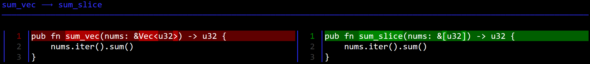
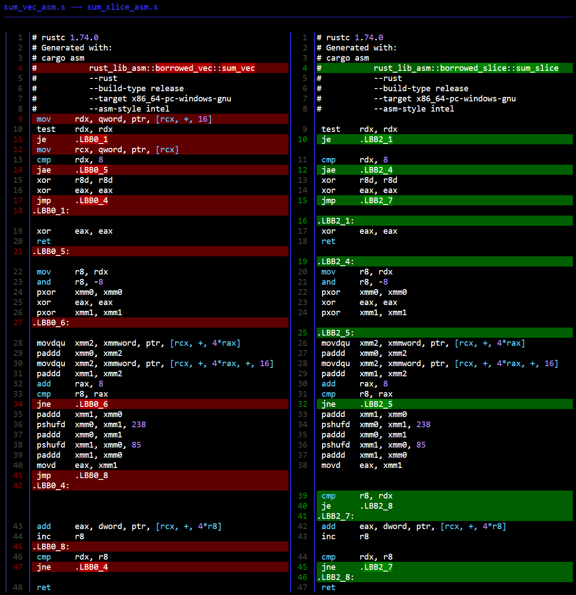

# Function signature argument types: `&Vec<u32>` vs. `&[u32]`
## Introduction
When implementing a function that operates on a `Vec<T>` many users default to specifying `&Vec<T>` as the type of the argument (or `&String` for owned strings), which makes sense at first and works as intended. This is a bad idea for several reasons which will be outlined in this document. By default, the compiler does not issue a warning while [Clippy](https://github.com/rust-lang/rust-clippy/) does with the `#[warn(clippy::ptr_arg)]` lint and [links to this explanation](https://rust-lang.github.io/rust-clippy/master/index.html#/ptr_arg), there's more to it than this explanations though.

## Compairing


>[Click here for the raw html from the image above](fn-diff.html)

## Assembly

>[Click here for the raw html from the image above](asm-diff.html)

## Assembly Explanation
The explanation focuses on the assembly generated for the slice case, the difference from the borrowed vector is outlined in the [conclusion](#conclusion).

The assembly handles 3 different cases depending on the number of elements in the slice, call this **N**.
1. **N == 0**
>return 0.
2. **N < 8**
>Sum elements one after the other.
3. **N >= 8**
>Sum 8 elements at a time using SIMD instructions until all elements are summed.

(4) If **N >= 8** but **N** is not 8-aligned the resulting scenario is equivelant to case 3 followed by case 2 on the remainder.

### 1. **N == 0**

```asm
# l. 9-10
 test    rdx, rdx # Test if `rdx` is 0
 je      .LBB2_1
# l. 16-18
.LBB2_1:
 xor     eax, eax # Set the return value to 0
 ret
```

### 2. **N < 8**

After the test for the case of `N==0` is not true, test if `N==8`:
```asm
# l. 11-15
 cmp     rdx, 8
 jae     .LBB2_4 # Jump if above or equal (CF=0)
 xor     r8d, r8d # Set the lower 32 bits of `r8` to 0.
 xor     eax, eax
 jmp     .LBB2_7
```
Sum the elements one by one and then return. Here `r8` is the loop counter (index in the slice).
```asm
# l. 41-47
 .LBB2_7:
# Add 4*r8 to the address of the first element, dereference that address and add the value to `eax`
 add     eax, dword, ptr, [rcx, +, 4*r8]
 inc     r8 # Increment loop counter
 cmp     rdx, r8 # Check if loop counter equals N
 jne     .LBB2_7
.LBB2_8:
 ret
```

### 3. **N >= 8**

Test if the length is 0, then if it's larger or equal to 8, then we jump to `.LBB2_4`
```asm
# l. 9-12
 test    rdx, rdx # Test if N==0
 je      .LBB2_1
 cmp     rdx, 8 # Compare N to 8
 jae     .LBB2_4 # Jump if above or equal (CF=0)
```
Move the length (N) into `r8` and align it with 8, to prepare for 128 bit wide SIMD addition, then set SIMD and return registers to 0.
```asm
# l. 19-24
.LBB2_4:
 mov     r8, rdx
 and     r8, -8 # Align with 8 (2's complement)
 pxor    xmm0, xmm0 # 128-bit wide SIMD register
 xor     eax, eax
 pxor    xmm1, xmm1
```
Now sum with SIMD in a loop until we're done or there's a remainder of elements less than 8.
`rax` is the loop counter/index in this case.
```asm
# l. 25-32
.LBB2_5:
 movdqu  xmm2, xmmword, ptr, [rcx, +, 4*rax] # Load the next 4 elements into `xmm2`
 paddd   xmm0, xmm2 # Add packed word integers from `xmm2` and `xmm0` and store them in `xmm0`
 movdqu  xmm2, xmmword, ptr, [rcx, +, 4*rax, +, 16] # Load the next 4 elements into `xmm2`
 paddd   xmm1, xmm2 # Add packed word integers from `xmm2` and `xmm1` and store them in `xmm1`
 add     rax, 8 # Add 8 to loop counter
 cmp     r8, rax # Compare the loop counter to the 8-aligned length (N), if not equal loop again
 jne     .LBB2_5
 ```
Once the loop has run until `rax` is equal to the 8-aligned length (N), we perform the final SIMD shuffling to get a single u32 out.
 ```asm
# l.33-40
# Adding and shuffling around the SIMD register values to store the final 32-bit value in the lowest dword of `xmm1`
 paddd   xmm1, xmm0
 pshufd  xmm0, xmm1, 238
 paddd   xmm0, xmm1
 pshufd  xmm1, xmm0, 85
 paddd   xmm1, xmm0
 movd    eax, xmm1 # Move lowest dword of `xmm1` into `eax`
 cmp     r8, rdx # Check if 8-aligned N equal N, if not we need to add the remainder
 je      .LBB2_8 # If N was 8-aligned then we can return
# l. 46-47
 .LBB2_8:
 ret
```
If N is not 8-aligned we add the remainder element-by-element, this state is equivelant to case 2 except that `eax` contains the sum of the SIMD additions, refer to [case 2](#2-n--8) for the explanation of one-by-one summation.

## Conclusion
Passing a borrowed vector `&Vec<T>` instead of a borrowed slice `&[T]` introduces an unneccesary indirection and narrows the usability of the function (cannot be used on an array). In trivial cases this indirection will be spotted by the compiler and optimized away, but the usability of the function remains limited [as described in the Clippy lint](https://rust-lang.github.io/rust-clippy/master/index.html#/ptr_arg). If the indirection is not removed by the compiler, the cost is extra instructions that might be costly if it means another roundtrip to fetch data, the extra instructions are visible on line 9, left side of the side-by-side view:
```asm
mov     rdx, qword, ptr, [rcx, +, 16]
```
The pointer to `Vec<u32>` is incremented by 16 and the address is derefenced to load it into `rdx`, this is the length of `Vec<u32>`.
This operation is unneccesary when using a slice because a slice is a pointer to the first element and a length (it also includes the size of the elements).
The introduced overhead is retrieving this information through the pointer to `Vec<u32>`.

The other additional overhead is loading the address of the first element into `rcx` on l. 12, left of the side-by-side view:
```asm
mov     rcx, qword, ptr, [rcx]
```
The rest of the operations are identical. The slice/vector is summed with SIMD instructions aligned to 8 elements in this case, any leftover elements that don't align are summed one-by-one in a loop l. 43-47 on the left and l. 39-45 on the right of the side-by-side view.

